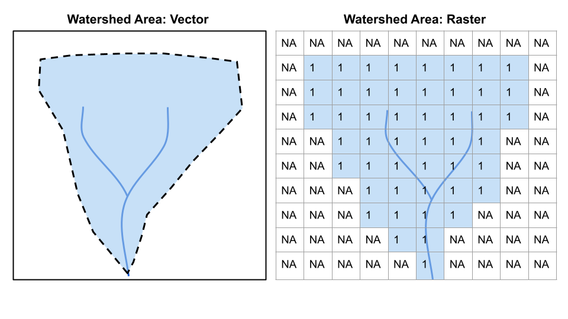
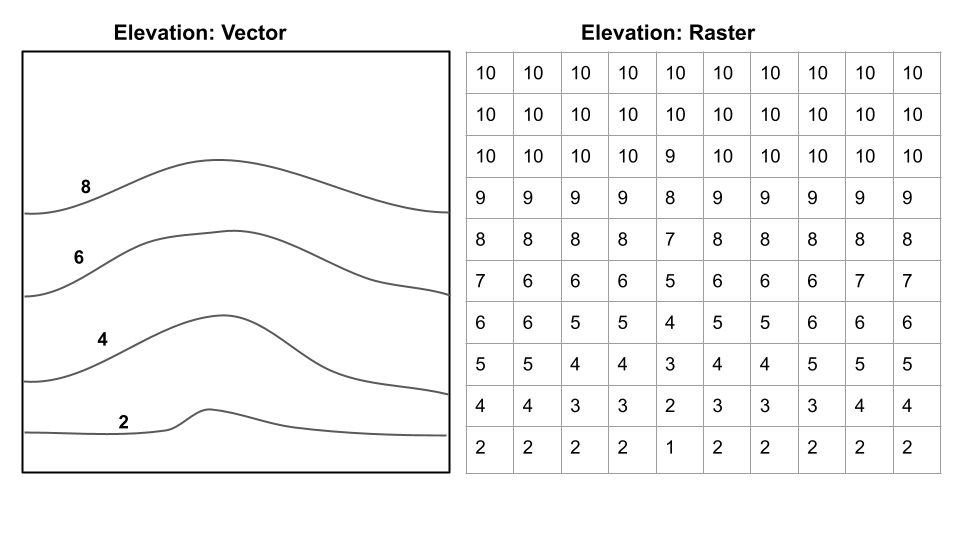

# Geospatial data in R - Vector {#rgeospatial}

The following activity is available as a template github repository at the following link: <https://github.com/VT-Hydroinformatics/12-Intro_Geospatial_Vector>

For more: <https://datacarpentry.org/r-raster-vector-geospatial/>

Much of this is adapted from: <https://geocompr.robinlovelace.net/index.html> Chapter 8

This demo uses data from the CAMELS dataset (full ref below) <https://ral.ucar.edu/solutions/products/camels>

A. Newman; K. Sampson; M. P. Clark; A. Bock; R. J. Viger; D. Blodgett, 2014. A large-sample watershed-scale hydrometeorological dataset for the contiguous USA. Boulder, CO: UCAR/NCAR. https://dx.doi.org/10.5065/D6MW2F4D


```{r, message=FALSE, warning=FALSE}
library(tidyverse)
library(sf)
library(tmap)    # for static and interactive maps
library(leaflet) # for interactive maps

theme_set(theme_classic())
```

## Goals

Our goals for this chapter are just to see some of the ways we can wrangle and plot vector spatial data using R. This is by no means the only way and is not an exhaustive demonstration of the packages loaded, but it'll get us started.

First, we need to define raster and vector spatial data.

Check out the images below for two examples of the same data represented as raster data or vector data.

Vector: Points, lines, polygons, boundaries are crisp regardless of scale Raster: Grid of same sized cells, vales in cells, cell size = resolution (smaller cells, higher resolution)





**Questions from these two images:**

*What are the advantages/disadvantages of raster/vector for each?* Which is best to show on a map for each?  \*For elevation, which would be better for calculating slope? 

So, today we are sticking to vector data, but then we will be deal primarily with raster elevation data.

## Intro to tmap

We are going to make maps mostly with tmap. But there are several other options (ggplot, leaflet, etc).

Let's look at how tmap works. It uses the same syntax as ggplot: the grammar of graphics.

First we want to set tmap to static map mode. This is what we would want if we were making maps for a manuscript or slides. You can also make interactive maps with tmap, which we will show later. We will also set the check.and.fix option in tmap_options to TRUE, we need to do this for the data we are using, but it isn't always necessary.

Second, we will read in our data. We'll read in the "smallerws" shapefile from the CAMELS dataset and another shapefile of the outline of US states. To read in the shapefiles we will use st_read() from the sf package.

Note that each of these shapefiles is in a separate folder and contains several files. You must have all of those files for the shapefile to work. *yes: "A shapefile" is actually several files. Silly? Maybe. The cause of much confusion when emailing someone "a shapefile"? Definitely.

Finally we will read in a csv called gauge information that has some extra info we will join to the watershed shapefile later. 

Once that is all done, we will look at the watershed data to see what is available in the shapefile attribute table.

*What extra information does the data have beyond a regular R object?* Play around with it, can you reference columns in the table the same way you would with a regular object?

```{r}
#make sure tmap is in static map mode


#the CAMELS shapefile throws an error about having 
#invalid polygons, this line allows it to plot


#Read shapefiles


#look at the watersheds shapefile data

```

Let's make a map showing the watersheds data. Each watershed has coordinates to draw it in the dataset, and tmap knows how to deal with that. It uses the same format as ggplot, but instead of ggplot() you will use tm_shape(). Then the geoms are prefixed tm\_, so we will use tm_fill to show a map of the watersheds filled in with a color.

```{r}
# Pass the watershed data to tmap and fill the polygons 

```

If we use tm_borders instead, it will just outline the watersheds.
```{r}
# Add border layer to shape

```
That's fun, and maybe you can guess what country we are in based on the distribution of watersheds, but it would be better to show some geopolitical boundaries to get a sense of where we are. 

To do this, we will use a second tm_shape and show the states data we read in on the plot as well. Just like in ggplot, you can use multiple tm_ functions to show multiple datsets on the same map.
```{r}
# Add border layer to shape

```

You can also show the SAME data with multiple geoms. Let's add tm_borders under the watershed portion of the map and before the states portion so we get fill and borders on out watersheds.

```{r}
# Add fill and border layers to shape

```

Okay, this is starting to look like a map! But we need to add elements to make it better.

We coudl do this all in one statement, but you can also save your existing map as a kind of "basemap" and then add to it later, just like with a ggplot object. We will save the above map as *usa*.

Then we can use several built in geometries in tmap to add a compass, scale, and title. Note the syntax for specifying the position of the objects. Again, you could do this all in one statement too if you wanted.

```{r}
#Save basic map object as "usa"

```

Below is an example of how to edit the "symbology" of the map. In other words, we want to color each of the polygons depending on a variable. Here we make the watersheds darker blue if they have a higher elevation.

The syntax below is basically (pseudo code):

> Represent watersheds as shapes +\
> color the shapes based on elev_mean, use 10 colors, use the Blues palette\
> add a legend in the bottom right, add some space for the title, define the title, position the title\
> add a compass at the bottom left\
> add a scale bar at the bottom left\

```{r}


```

## Data wrangling with tidyverse principles

You can use the same techniques as with other data to change or filter the spatial data. Below we filter to show just watershed number 3164000, which will be in quotes because the column is a character datatype. Note when we looked at the watersheds object above there is a column called hru_id for the watershed ids.

```{r}
 
```
## Add non-spatial data to spatial data with a join

We have been using thew watersheds shapefile. The other dataset we read in "gageinfo" has more data, but it is just a regular tibble, not a geospatial file.

We need to attach data from gageinfo object to the watersheds geospatial object based on watershed ID. How in the world will we do that?

A JOIN!!

In watersheds shapefile the watershed ids are in a column called *hru_id* and in gageinfo tibble they are in a column called *GAGE_ID*. So when we do the join, we need to tell R that these columns are the same and we want to use them to match the values. We will do a left join to accomplish this.

BUT. TWIST! 

Let's look at the first value in hru_id in watersheds: "1013500"
Now the same one in GAGE_ID in gageinfo: "01013500"

They're both the same IDs, but one has a leading zero. And because they are character format, "1013500" does not equal "01013500". We can address this a couple of ways, but the best is probably to keep them as characters, but add a leading 0 to the hru_id column.

We will do this by creating a new column with a mutate and using the paste0() function to add a leading 0. To make the join easier, we will also give this new column the same name as in the gageinfo tibble: "GAGE_ID".

To review joins, check out chapter \@ref(getdata)

```{r}
#add leading 0 to hru_id column and save it as GAGE_ID


#join watersheds and gageinfo using the GAGE_ID column as the key

```

And now we can plot this formerly non-spatial data on our map.

In this case, we can now add the name of the watershed to the map rather than the number.

```{r}
#now the gageinfo columns are available for us to use when mapping

```
We can also subset vector data to create new datasets or plot. Below we will use filter statements to grab all the polygons in Virginia from the watersheds shapefile and then the Virginia state outline from the states shapefile.

The method we will use for getting the Virginia watersheds is a little new. We are going to use the grepl() function to grab any gages that include the text ", VA" since there isn't a state column, but the watershed names include the state.

Why are we doing ", VA" and not just "VA"? Good question!

", VA" will most likely only show up in gage names that are in Virginia because they'll be in the format "Gage name, VA". If we just say "VA" we might get some gages that have "VA" as part of their name but are not in Virginia.

Once we successfully filter to Virginia, we will then make a nice map of the CAMELS watersheds in Virginia!

```{r}

```

In addition to filtering, we can use the data in the attribute table to calculate additional parameters, just like with a normal object. Below we calculate the ratio of Area to Perimeter by changing the perimeter datatype to numeric and then dividing area by perimeter.

```{r}


```

Now we can plot our newly calculated data by controlling color with that new column name.

```{r}

```

## Plot maps side by side

Just like we can use facets in ggplot, we can use facets to show multiple maps. Below we color our map by AREA and elev_mean and put them next to each other using tm_facets.

```{r}


```

## Built in styles, like themes in ggplot

Tmap also has built in styles, which are like themes in ggplot. We can use these styles with tm_style. Try "classic", "coblat", or "col_blind" below.

```{r}

  
```

## Interactive Maps

### tmap

You can also generate maps that you can interact with, as opposed to static maps, that we have been using before. If you are generating a map for an app or webpage, this may be a good choice. But for a pdf report, the static maps are more appropriate.

In tmap all you have to do is run tmap_mode("view") and it will create an interactive map with the exact same syntax! To switch back to a static map, run tmap_mode("plot")

Also in this chunk we see how to add a basemap to a tmap object, using tm_basemap.

```{r}

```

### Leaflet

Leaflet is another way to make interactive maps. It's syntax is very different, as you can see below. But depending on what functionality you need, it could be a better choice.

```{r}
leaflet(watersheds_info) %>% 
  addTiles() %>%
  addPolygons(color = "#444444", weight = 1, smoothFactor = 0.5,
    opacity = 1.0, fillOpacity = 0.5,
    fillColor = ~colorQuantile("YlOrRd", elev_mean)(elev_mean))
```
